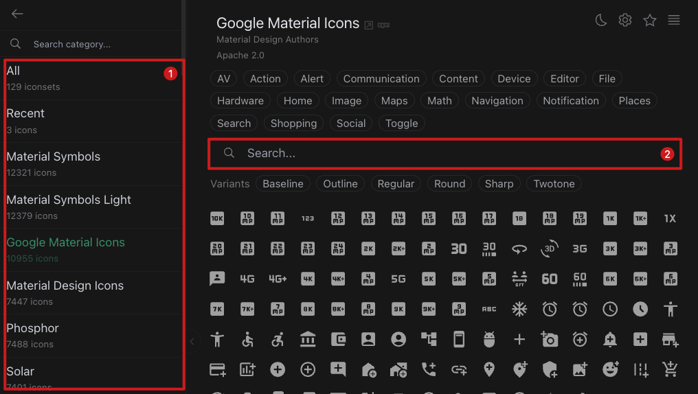
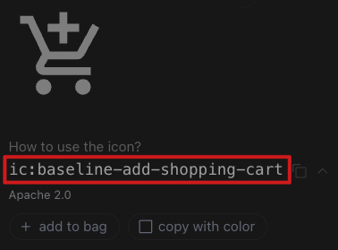
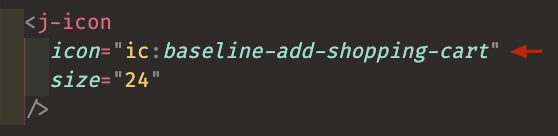

# Icon <Badge type="info" text="單一元件" />

<!--  -->

## 簡介

`Icon` 元件提供了一個簡易的 icon 顯示方式，讓使用者透過 [Icon Library](https://icones.js.org/collection/ic) 取得 icon，並依需求快速自訂大小

## VSCode Snippet

```
jicon
```

## 元件程式碼

```javascript
<script setup>
  import { ref } from 'vue'
  import Icon from '../icon.vue'
</script>

<template>
  <Icon
    icon="Icon Library 圖標代碼"
    size="轉換單位px"
  />
</template>
```

## Icon 元件使用方式

::: details 點擊查看詳細說明

### [STEP 1] 選擇圖標庫

進入[Icon Library](https://icones.js.org/collection/ic)，左側(下圖<svg xmlns="http://www.w3.org/2000/svg" width="18" height="18" viewBox="0 0 256 256" style="display: inline-block;vertical-align: text-top"><g fill="currentColor"><path d="M224 128a96 96 0 1 1-96-96a96 96 0 0 1 96 96" opacity=".2"/><path d="M128 24a104 104 0 1 0 104 104A104.11 104.11 0 0 0 128 24m0 192a88 88 0 1 1 88-88a88.1 88.1 0 0 1-88 88m12-136v96a8 8 0 0 1-16 0V95l-11.56 7.71a8 8 0 1 1-8.88-13.32l24-16A8 8 0 0 1 140 80"/></g></svg>)為 Icon Library 中包含的圖標庫，開發人員可依設計需求選擇合適的圖標庫。如需同時混用不同圖標庫時，建議選擇相近的設計風格，否則容易造成頁面視覺衝突。

### [STEP 2] 搜尋 icon

在下圖<svg xmlns="http://www.w3.org/2000/svg" width="18" height="18" viewBox="0 0 24 24" style="display: inline-block;vertical-align: text-top"><g fill="none"><circle cx="12" cy="12" r="9" fill="currentColor" opacity=".16"/><circle cx="12" cy="12" r="9" stroke="currentColor" stroke-linecap="round" stroke-linejoin="round" stroke-width="2"/><path stroke="currentColor" stroke-linecap="round" stroke-linejoin="round" stroke-width="2" d="M9.5 9.5a2.5 2.5 0 1 1 4.268 1.768l-3.829 3.828a1.5 1.5 0 0 0-.439 1.06V17h5"/></g></svg>處輸入關鍵字搜尋



### [STEP 3] 複製圖標代碼

選定目標 icon 後，複製 icon 下方的 `圖標代碼`



### [STEP 4] 貼上圖標代碼即可使用

將複製的 `圖標代碼` 貼在元件的 `icon prop` 位置即可使用

詳細元件屬性介紹請參考下方 **元件 Props** 說明



:::

## 元件 Props

| Prop Name | type   | 預設 | 說明                                                                                                                | required |
| :-------- | :----- | :--- | :------------------------------------------------------------------------------------------------------------------ | :------- |
| icon      | String | Null | icon 圖標代碼，如需更換請透過[連結](https://icones.js.org/collection/ic)查詢，操作方法 [請點](../comp_utility/icon) | true     |
| size      | String | 18   | 數字會被轉換為 icon 長與寬，單位 px                                                                                 | false    |
