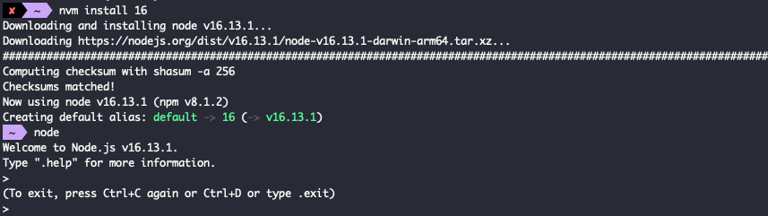

# Node.js 安裝流程

## 簡介

`Node.js` 是能夠在伺服器上面運行 `JavaScript` 的應用平台環境，透過 `Node.js` 提供的函式庫與執行環境能完成伺服器端服務，提供各種網路應用。

## 官網下載 Node.js

:::warning
正式開始安裝前，請輸入下列指令檢查是否正確安裝 `NVM`

```
nvm --version
```

[詳細 NVM 安裝方式請參照此連結](install-nvm)
:::

前往[官網](https://nodejs.org/en)提供穩定版 (LTS) 與最新版 (Current) 可選擇，選擇穩定版即可。安裝方式大多簡單快速通過即可

接下來依序輸入以下指令 `nvm install` 加上 `<版本號>` ，就會開始安裝 Node.js 的環境。

```cmd
$ nvm install <version>
```

安裝過程如下圖，完成安裝後輸入 node 查看是否正確安裝。


## NVM 基本指令

以下列出常用 NVM 指令用法

```cmd
$ nvm -v                            #查看 NVM 版本，同 nvm -version
$ nvm install <version>             #安裝特定版本的 Node.js
$ nvm uninstall <version>           #解除安裝特定版本的 Node.js
$ nvm use <version>                 #當前命令列套用特定版本的 Node.js
$ nvm ls                            #列出本定端所安裝的 Node.js 環境
$ nvm ls-remote                     #列出目前可用的遠端 Node.js 版本
$ nvm alias default <version>       #設定命令列預設開啟的 Node.js 版本
$ nvm --version                     #查看 nvm 版本
$ nvm which <version>               #查看某一版本 nvm 的 PATH
```
