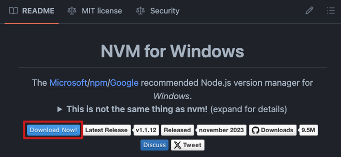
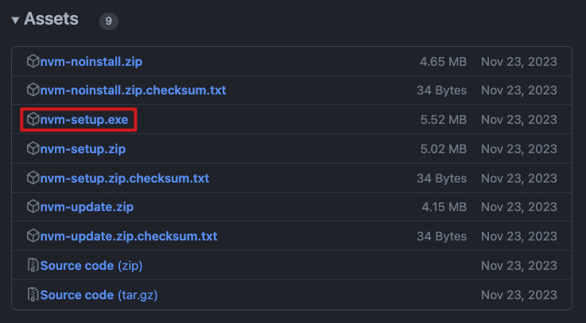
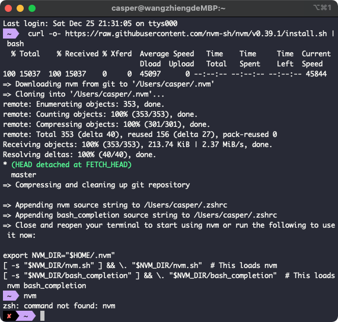
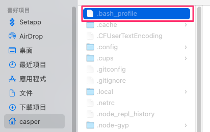
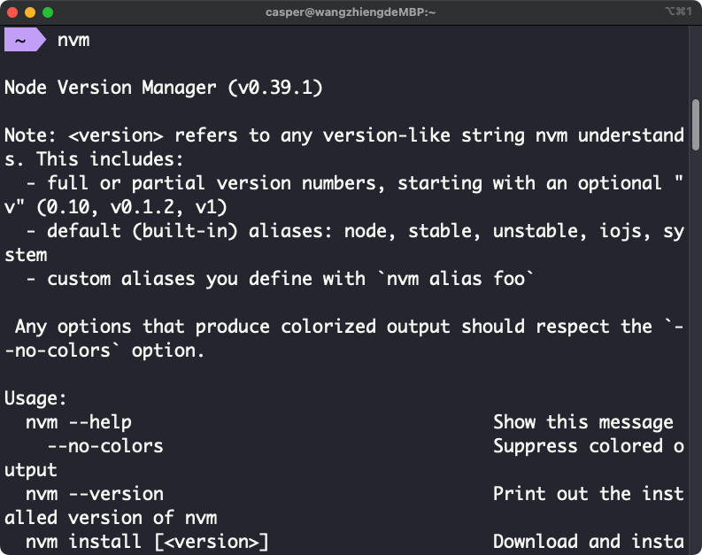

# NVM 安裝流程

## 簡介

`nvm` 是用來管理設備上 `Node.js` 版本的管理器 (version manager)，可在同一台主機上安裝多個版本的 `Node.js` 環境，因為不同專案可能會使用不同的 `Node.js` 版本，那就需要透過一個版本管理器來切換不同的 `Node.js` 版本。

以下介紹如何分別在 Windows 或 Mac 上安裝 NVM

## 在 Windows 上安裝 NVM

::: details 點擊查看詳細安裝方式

### [STEP 1] 點擊立即下載

在 [nvm-windows](https://github.com/coreybutler/nvm-windows#readme)倉庫的 Readme 檔案中，按一下「Download Now」：



這將開啟一個顯示不同 NVM 版本的頁面。

### [STEP 2] 安裝最新版本的.exe 文件

在最新版本中，你會發現不同的資源。按一下 nvm-setup.exe 資源，它是該工具的安裝檔：


### [STEP 3] 確認安裝完成

完成後，你可以透過執行以下命令確認 NVM 已安裝

```cmd
$ nvm -v
```

:::

## 在 Mac 上安裝 NVM

::: details 點擊查看詳細安裝方式

### [STEP 1]

打開「終端機」或自行安裝的「iTerm」等工具，輸入以下指令即可開始安裝

```cmd
$ curl -o- https://raw.githubusercontent.com/nvm-sh/nvm/v0.39.1/install.sh | bash
```

你可以根據設備上可用的命令使用 curl 或 bash。
這些指令會將 NVM 倉庫複製到裝置上的~/.nvm 目錄。

安裝後預期會顯示以下片段及算安裝完成，而此時如果你有安裝其它指令工具，有可能會發生輸入 nvm 無法呼叫的狀況（例如：zsh: command not found: nvm）。

接下來可以在你所使用的命令設定檔案加入以下片段程式碼，以下提供 bash、zsh 的說明，兩者依據環境選擇其一即可：

- bash（預設）
- zsh

#### bash:

預設的情況下，MacOS 中可能沒有任何一個指令設定檔案，此時可以使用 touch ~/.bash_profile 新增一個文字檔案在根目錄上，接下來回到資料根目錄可以找到 .bash_profile，沒看到的話代表未開啟隱藏檔案顯示，可以按下 Command + Shift+ . 顯示。

接下來使用任何文字編輯器打開該檔案，並加入以下程式碼存檔即可。

```cmd
export NVM_DIR="$HOME/.nvm"
[ -s "$NVM_DIR/nvm.sh" ] && \. "$NVM_DIR/nvm.sh"  # This loads nvm
[ -s "$NVM_DIR/bash_completion" ] && \. "$NVM_DIR/bash_completion"  # This loads nvm bash_completion
```

#### zsh:

可以打開 .zshrc 加入以下片段後重啟（注意：.zshrc 通常在使用者根目錄下並且為隱藏檔，找到後使用任何文字編輯器打開編輯）。

```cmd
export NVM_DIR="$HOME/.nvm"
[ -s "$NVM_DIR/nvm.sh" ] && \. "$NVM_DIR/nvm.sh"  # This loads nvm
[ -s "$NVM_DIR/bash_completion" ] && \. "$NVM_DIR/bash_completion"  # This loads nvm bash_completion
```

設定完成以後，按下 nvm 就會跳出如下圖就算完成了。

:::
